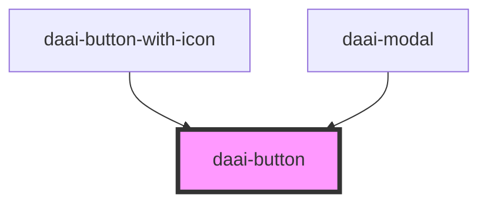

# daai-button

<!-- Auto Generated Below -->

## Properties

| Property  | Attribute | Description | Type                          | Default    |
| --------- | --------- | ----------- | ----------------------------- | ---------- |
| `onClick` | --        |             | `(event: MouseEvent) => void` | `() => {}` |

## Dependencies

### Used by

- [daai-button-with-icon](../../molecules/daai-button-with-icon)
- [daai-modal](../../molecules/daai-modal)

### Graph

---

_Built with [StencilJS](https://stenciljs.com/)_
