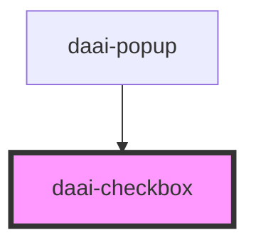

# daai-checkbox

<!-- Auto Generated Below -->

## Properties

| Property   | Attribute  | Description | Type      | Default |
| ---------- | ---------- | ----------- | --------- | ------- |
| `checked`  | `checked`  |             | `boolean` | `false` |
| `disabled` | `disabled` |             | `boolean` | `false` |
| `label`    | `label`    |             | `string`  | `""`    |

## Events

| Event    | Description | Type                   |
| -------- | ----------- | ---------------------- |
| `change` |             | `CustomEvent<boolean>` |

## Dependencies

### Used by

 - [daai-popup](../../molecules/daai-popup)

### Graph

----------------------------------------------

*Built with [StencilJS](https://stenciljs.com/)*
