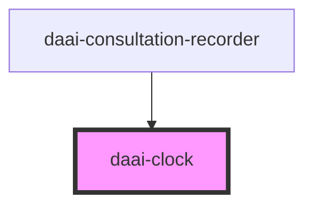

# daai-clock

<!-- Auto Generated Below -->

## Properties

| Property | Attribute | Description | Type     | Default       |
| -------- | --------- | ----------- | -------- | ------------- |
| `status` | `status`  |             | `string` | `"recording"` |

## Dependencies

### Used by

 - [daai-consultation-recorder](../../templates/daai-consultation-recorder)

### Graph

----------------------------------------------

*Built with [StencilJS](https://stenciljs.com/)*
