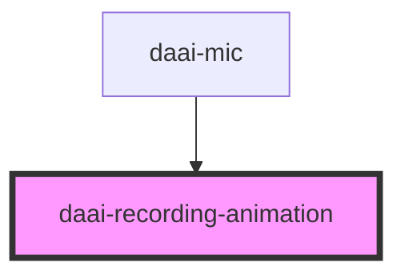

# daai-recording-animation

<!-- Auto Generated Below -->

## Properties

| Property                  | Attribute                   | Description | Type     | Default     |
| ------------------------- | --------------------------- | ----------- | -------- | ----------- |
| `animationPausedColor`    | `animation-paused-color`    |             | `string` | `'#009CB1'` |
| `animationRecordingColor` | `animation-recording-color` |             | `string` | `'#F43F5E'` |
| `status`                  | `status`                    |             | `string` | `undefined` |

## Dependencies

### Used by

 - [daai-mic](../../organisms/mic)

### Graph

----------------------------------------------

*Built with [StencilJS](https://stenciljs.com/)*
