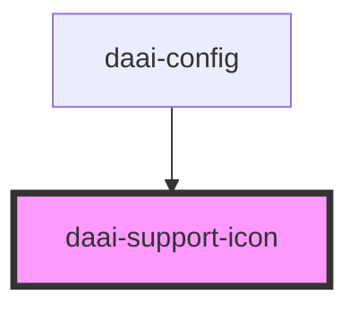

# daai-support-icon

<!-- Auto Generated Below -->

## Properties

| Property | Attribute | Description | Type     | Default     |
| -------- | --------- | ----------- | -------- | ----------- |
| `color`  | `color`   |             | `string` | `"#64748B"` |
| `height` | `height`  |             | `string` | `"20px"`    |
| `width`  | `width`   |             | `string` | `"20px"`    |

## Dependencies

### Used by

 - [daai-config](../../molecules/daai-config)

### Graph

----------------------------------------------

*Built with [StencilJS](https://stenciljs.com/)*
