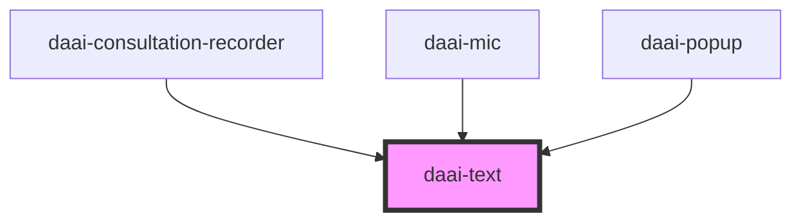

# daai-text

<!-- Auto Generated Below -->

## Properties

| Property | Attribute | Description | Type                          | Default     |
| -------- | --------- | ----------- | ----------------------------- | ----------- |
| `tag`    | `tag`     |             | `keyof HTMLElementTagNameMap` | `'p'`       |
| `text`   | `text`    |             | `string`                      | `undefined` |

## Dependencies

### Used by

 - [daai-consultation-recorder](../../templates/daai-consultation-recorder)
 - [daai-mic](../../organisms/mic)
 - [daai-popup](../../molecules/daai-popup)

### Graph

----------------------------------------------

*Built with [StencilJS](https://stenciljs.com/)*
