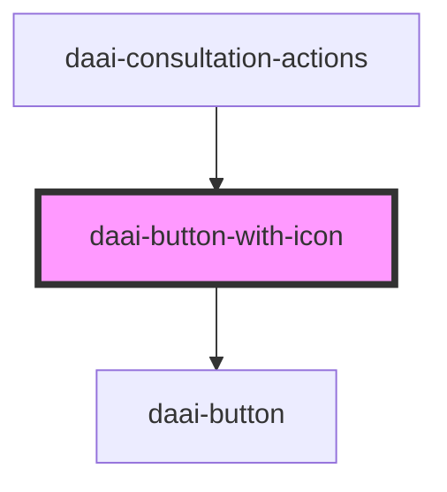

# daai-button-with-icon

<!-- Auto Generated Below -->

## Properties

| Property   | Attribute  | Description | Type      | Default |
| ---------- | ---------- | ----------- | --------- | ------- |
| `disabled` | `disabled` |             | `boolean` | `false` |

## Dependencies

### Used by

 - [daai-consultation-actions](../../organisms/daai-consultation-actions)

### Depends on

- [daai-button](../../atoms/button)

### Graph

----------------------------------------------

*Built with [StencilJS](https://stenciljs.com/)*
