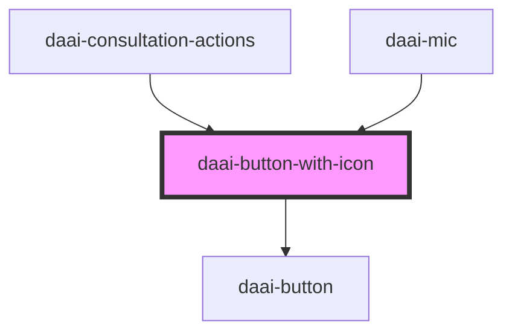

# daai-button-with-icon

<!-- Auto Generated Below -->

## Properties

| Property   | Attribute  | Description | Type                       | Default     |
| ---------- | ---------- | ----------- | -------------------------- | ----------- |
| `disabled` | `disabled` |             | `boolean`                  | `false`     |
| `type`     | `type`     |             | `"primary" \| "secondary"` | `'primary'` |

## Dependencies

### Used by

 - [daai-consultation-actions](../../organisms/daai-consultation-actions)
 - [daai-mic](../../organisms/mic)

### Depends on

- [daai-button](../../atoms/button)

### Graph

----------------------------------------------

*Built with [StencilJS](https://stenciljs.com/)*
