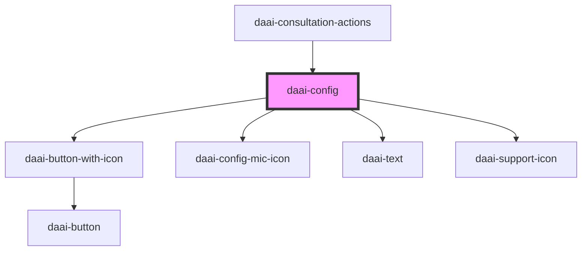

# daai-config

<!-- Auto Generated Below -->

## Dependencies

### Used by

 - [daai-consultation-actions](../../organisms/daai-consultation-actions)

### Depends on

- [daai-button-with-icon](../daai-button-with-icon)
- [daai-config-mic-icon](../../atoms/icons)
- [daai-text](../../atoms/text)
- [daai-support-icon](../../atoms/icons)

### Graph

----------------------------------------------

*Built with [StencilJS](https://stenciljs.com/)*
