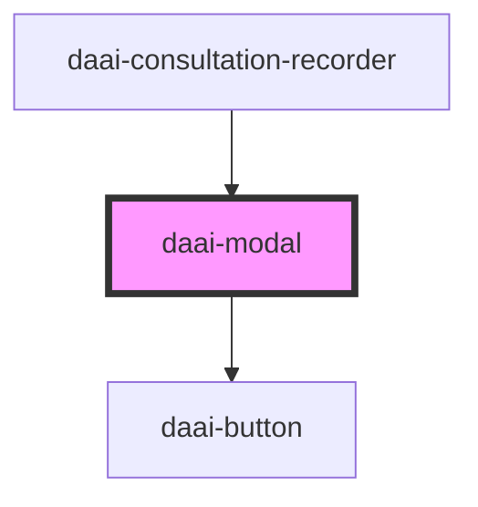

# daai-modal

<!-- Auto Generated Below -->

## Properties

| Property      | Attribute      | Description | Type     | Default |
| ------------- | -------------- | ----------- | -------- | ------- |
| `headerTitle` | `header-title` |             | `string` | `''`    |
| `items`       | --             |             | `any[]`  | `[]`    |

## Dependencies

### Used by

 - [daai-consultation-recorder](../../templates/daai-consultation-recorder)

### Depends on

- [daai-button](../../atoms/button)

### Graph

----------------------------------------------

*Built with [StencilJS](https://stenciljs.com/)*
