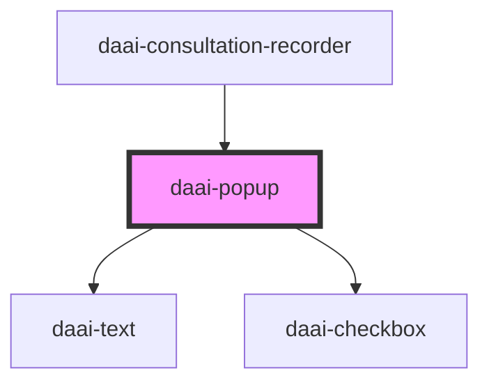

# daai-popup

<!-- Auto Generated Below -->

## Properties

| Property       | Attribute      | Description | Type                                           | Default     |
| -------------- | -------------- | ----------- | ---------------------------------------------- | ----------- |
| `apikey`       | `apikey`       |             | `string`                                       | `undefined` |
| `metadata`     | --             |             | `{ [x: string]: any; }`                        | `undefined` |
| `mode`         | `mode`         |             | `string`                                       | `undefined` |
| `professional` | `professional` |             | `string`                                       | `undefined` |
| `start`        | --             |             | `(consultation: ConsultationResponse) => void` | `undefined` |

## Dependencies

### Used by

 - [daai-consultation-recorder](../../templates/daai-consultation-recorder)

### Depends on

- [daai-text](../../atoms/text)
- [daai-checkbox](../../atoms/daai-checkbox)

### Graph

----------------------------------------------

*Built with [StencilJS](https://stenciljs.com/)*
