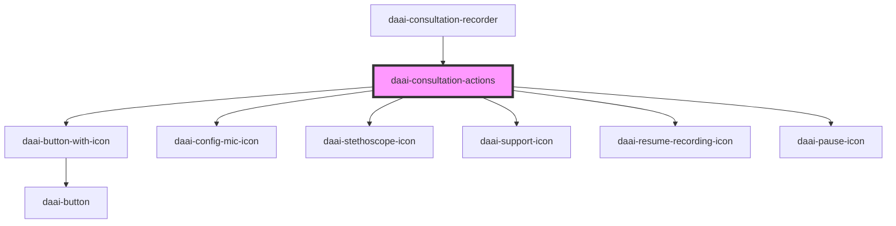

# daai-consultation-actions

<!-- Auto Generated Below -->

## Properties

| Property       | Attribute      | Description | Type      | Default     |
| -------------- | -------------- | ----------- | --------- | ----------- |
| `apikey`       | `apikey`       |             | `any`     | `undefined` |
| `error`        | `error`        |             | `any`     | `undefined` |
| `metadata`     | `metadata`     |             | `string`  | `undefined` |
| `specialty`    | `specialty`    |             | `any`     | `undefined` |
| `success`      | `success`      |             | `any`     | `undefined` |
| `telemedicine` | `telemedicine` |             | `boolean` | `undefined` |

## Dependencies

### Used by

 - [daai-consultation-recorder](../../templates/daai-consultation-recorder)

### Depends on

- [daai-button-with-icon](../../molecules/daai-button-with-icon)
- [daai-config-mic-icon](../../atoms/icons)
- [daai-stethoscope-icon](../../atoms/icons)
- [daai-support-icon](../../atoms/icons)
- [daai-resume-recording-icon](../../atoms/icons)
- [daai-pause-icon](../../atoms/icons)

### Graph

----------------------------------------------

*Built with [StencilJS](https://stenciljs.com/)*
