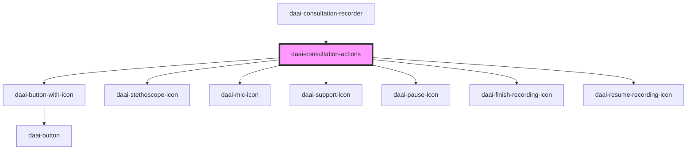

# daai-consultation-actions

<!-- Auto Generated Below -->

## Properties

| Property    | Attribute    | Description | Type     | Default     |
| ----------- | ------------ | ----------- | -------- | ----------- |
| `apiKey`    | `api-key`    |             | `string` | `undefined` |
| `metadata`  | `metadata`   |             | `string` | `undefined` |
| `onError`   | `on-error`   |             | `any`    | `undefined` |
| `onSuccess` | `on-success` |             | `any`    | `undefined` |
| `specialty` | `specialty`  |             | `string` | `undefined` |

## Dependencies

### Used by

 - [daai-consultation-recorder](../../templates/daai-consultation-recorder)

### Depends on

- [daai-button-with-icon](../../molecules/daai-button-with-icon)
- [daai-stethoscope-icon](../../atoms/icons)
- [daai-mic-icon](../../atoms/icons)
- [daai-support-icon](../../atoms/icons)
- [daai-pause-icon](../../atoms/icons)
- [daai-finish-recording-icon](../../atoms/icons)
- [daai-resume-recording-icon](../../atoms/icons)

### Graph

----------------------------------------------

*Built with [StencilJS](https://stenciljs.com/)*
