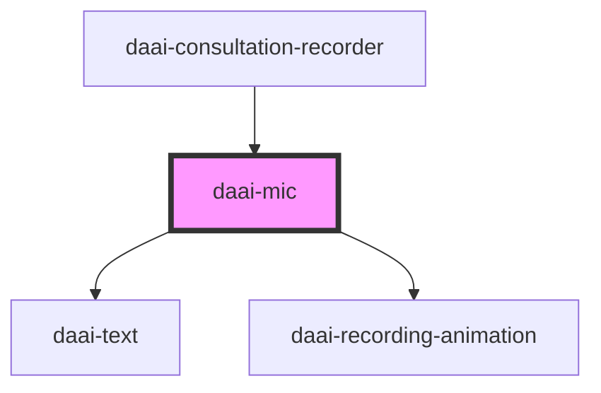

# daai-mic

<!-- Auto Generated Below -->

## Events

| Event            | Description | Type                                          |
| ---------------- | ----------- | --------------------------------------------- |
| `interfaceEvent` |             | `CustomEvent<{ microphoneSelect: boolean; }>` |

## Dependencies

### Used by

 - [daai-consultation-recorder](../../templates/daai-consultation-recorder)

### Depends on

- [daai-text](../../atoms/text)
- [daai-recording-animation](../../atoms/daai-recording-animation)

### Graph

----------------------------------------------

*Built with [StencilJS](https://stenciljs.com/)*
