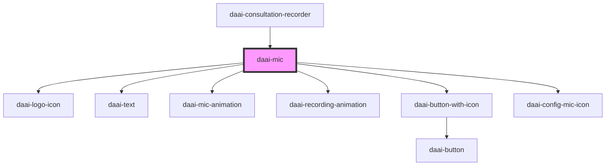

# daai-mic

<!-- Auto Generated Below -->

## Dependencies

### Used by

 - [daai-consultation-recorder](../../templates/daai-consultation-recorder)

### Depends on

- [daai-logo-icon](../../atoms/icons)
- [daai-text](../../atoms/text)
- [daai-mic-animation](../../atoms/daai-mic-animation)
- [daai-recording-animation](../../atoms/daai-recording-animation)
- [daai-button-with-icon](../../molecules/daai-button-with-icon)
- [daai-config-mic-icon](../../atoms/icons)

### Graph

----------------------------------------------

*Built with [StencilJS](https://stenciljs.com/)*
