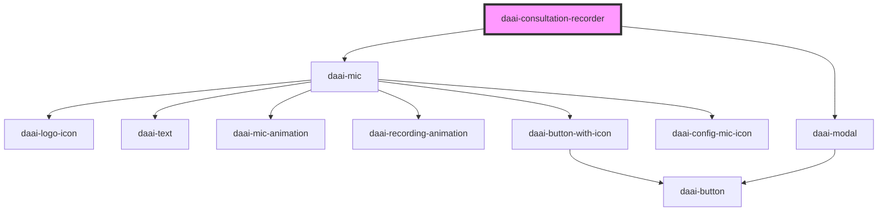

# daai-consultation-recorder

<!-- Auto Generated Below -->

## Dependencies

### Depends on

- [daai-mic](../../organisms/mic)
- [daai-modal](../../molecules/daai-modal)

### Graph

----------------------------------------------

*Built with [StencilJS](https://stenciljs.com/)*
