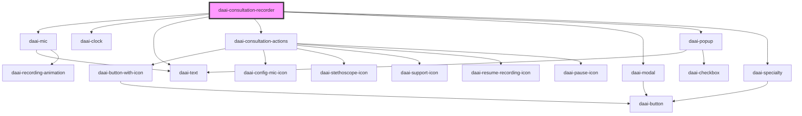

# daai-consultation-recorder

<!-- Auto Generated Below -->

## Properties

| Property       | Attribute      | Description | Type                           | Default                 |
| -------------- | -------------- | ----------- | ------------------------------ | ----------------------- |
| `apikey`       | `apikey`       |             | `string`                       | `undefined`             |
| `metadata`     | `metadata`     |             | `string`                       | `undefined`             |
| `onError`      | --             |             | `(err: Error) => void`         | `undefined`             |
| `onEvent`      | --             |             | `(response: Response) => void` | `undefined`             |
| `onSuccess`    | --             |             | `(response: Response) => void` | `undefined`             |
| `specialty`    | `specialty`    |             | `string`                       | `state.chooseSpecialty` |
| `telemedicine` | `telemedicine` |             | `boolean`                      | `undefined`             |

## Dependencies

### Depends on

- [daai-mic](../../organisms/mic)
- [daai-clock](../../atoms/daai-clock)
- [daai-text](../../atoms/text)
- [daai-consultation-actions](../../organisms/daai-consultation-actions)
- [daai-modal](../../molecules/daai-modal)
- [daai-popup](../../molecules/daai-popup)
- [daai-specialty](../../molecules/daai-specialty)

### Graph

----------------------------------------------

*Built with [StencilJS](https://stenciljs.com/)*
